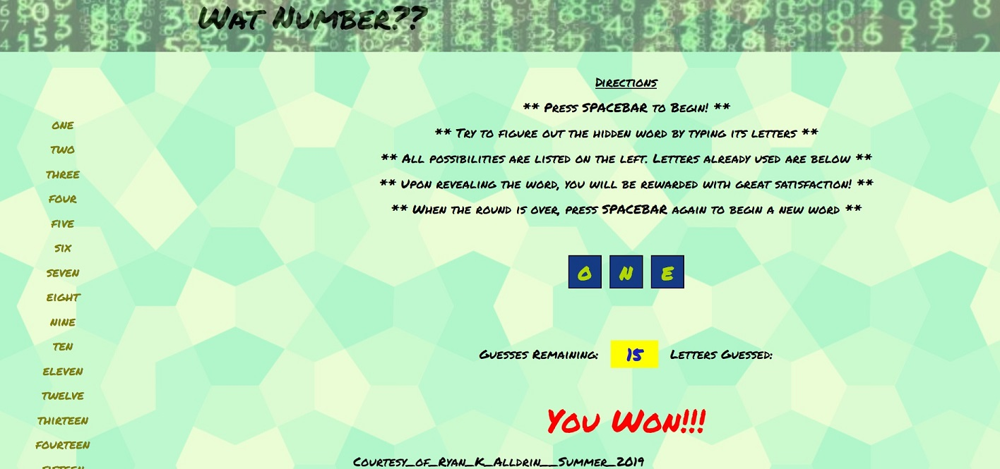

# Word Guess

#### How To Use:
Press spacebar to begin, and type letters on keyboard to guess the letters.  If you are correct, the letter will be displayed.  When you have used all your turns, the game is over, and you can press spacebar to begin again on a new random word.

[See it Live](https://akaryrye.github.io/word_guess/)

#### Installation:
````
HTTPS:   $ Git Clone https://github.com/akaryrye/word_guess.git
````
````
SSH:   $ Git Clone git@github.com:akaryrye/word_guess.git
````
Then, simply open index.html in your browser.

#### Technologies:
HTML, CSS, Vanilla JS

#### Author:
Ryan K Alldrin



Thank you for checking it out and I hope you enjoyed this!
